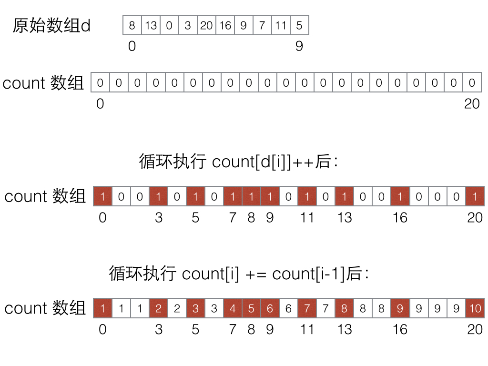

#计数排序

#目录
  - [简述](#简述)
  - [原理](#原理)
  	- [主要思想](#主要思想)
  	- [特点](#特点)
  - [参考代码](#参考代码)
  - [练习题目](#练习题目)
  - [参考资料](#参考资料)
  
  
## 简述
  **计数排序**（Counting sort）是一种**稳定的线性时间排序算法**，Θ(n + k)的时间复杂度。n 是待排序数组的大小，k 是辅助数组 count 的大小。
  
  因为它并不是基于比较的的排序算法，所以它没有O(NlogN)的下限。并且在一定的条件下，使用该算法比使用快排能带来更好的效率。例如在基数排序中就运用了计数排序，因为它只需要额外的10个元素大小的辅助数组，线性的效率，并保证了稳定性。

---

## 原理
### 主要思想
  计数排序的主要思想是将待排序元素的值作为下标，利用辅助数组 count 记录所有的元素出现的次数。即 count[i] 的值代表元素 i 在原始数组中出现的次数。这样，原始数组的所有元素就被有有序地记录下来。
  
  当然，只知道某个元素出现的次数是不足以排序的。仔细观察 count 数组，发现对 count 数组进行累加（count[i] += count[i-1]）后，count[i] 的含义就变成了原始数组 i 前面有 count[i]个数是不大于它的。最后就可以根据 count 数组中的排名去构造一个已排序的数组了。
  
  下面以原始数组d = {8, 13, 0, 3, 20, 16, 9, 7, 11, 5} 去演示上述的过程：
  
  

  或者是数组中有重复元素的情况：
  
  
  
 
### 特点
  计数排序虽然效率高，却有其受限的条件。
  
  - 只能对[0, K]区间的非负整数进行排序。
  - 当 K 很大时，空间复杂度会变得很大。
  
所以，如果是对于[0, 100]这样的区间，计数排序是个好的选择。考虑到空间复杂度的优化，也可以用原始数组中的 (最大值 - 最小值 + 1) 作为 count 数组的大小。

---

## 参考代码

``` c++
/*
	数组 d 的元素只能位于[0, K)区间的非负整数，O(n + K)
*/
void counting_sort(int *d, int n)
{
	int max = 0, min = INT_MAX;
	for (int i = 0; i < n; i++) {
		if (max < d[i])
			max = d[i];
		if (min > d[i])
			min = d[i];
	}
	max++;
	int  *count = (int *)malloc(sizeof(int) * (max - min)); //优化空间
	int  *ans = (int *)malloc(sizeof(int) * n);
	
	for (int i = 0; i < max; ++i) count[i] = 0;
	for (int i = 0; i < n; ++i) count[d[i] - min]++;
	for (int i = 1; i < max; ++i) count[i] += count[i - 1];
	//这里必须逆序循环，不然会造成排序结果失去稳定性。
	for (int i = n - 1; i >= 0; --i) ans[ --count[d[i]- min] ] = d[i];
	
	for (int i = 0; i < n; ++i) d[i] = ans[i]; 
}
```
---

## 练习题目
[hdu 1280](http://acm.hdu.edu.cn/showproblem.php?pid=1280)：这道题因为测试数据没有负数比较水，所以可以用计数排序解决。

---

## 参考资料
- [维基百科](https://en.wikipedia.org/wiki/Counting_sort)
